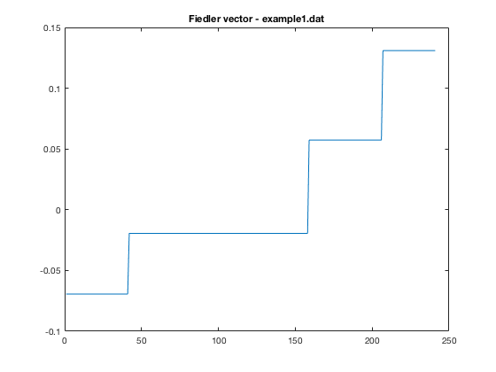
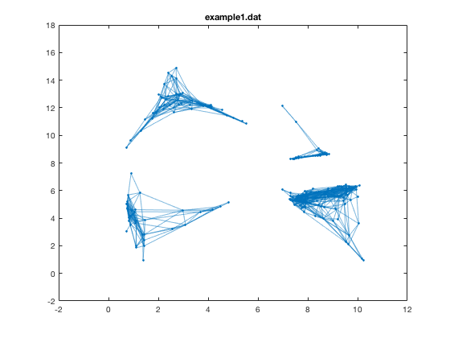
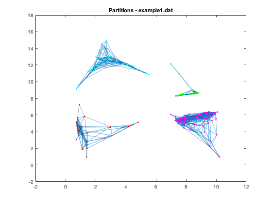
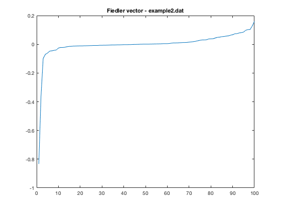
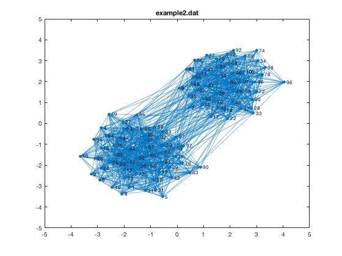
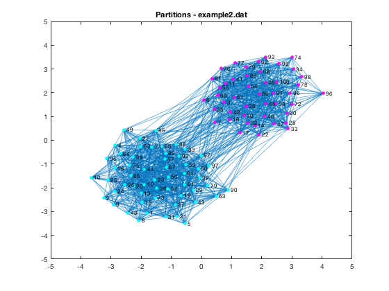

# ID2222 Assignment report 4
### Graph Spectra

Authors:

- Marco Dallagiacoma [marcoda@kth.se](mailto:marcoda@kth.se)
- Roberto Bampi [bampi@kth.se](mailto:bampi@kth.se)

The purpose of this second assignment is to implement spectral graph clustering as described in the paper “On Spectral Clustring: Analysis and an algorithm” by Andrew Y. Ng et al.

The code is implemented as a matlab script.

# Solution

The code is divided in two main parts, the first one to compute and plot the Fiedler vector and the second one to perform the clustering and plot the partitioned graph.
The Fiedler vector is only used to analyse the structure of the graph, but it is not used to perform the actual partitioning.

# Execution
We executed the code on the two provided datasets `example1.dat` and `example2.dat`.

## example1.dat
We first compute and plot the Fiedler vector of the graph.
The Fiedler vector is the eigenvector corresponding to the second smallest eigenvalue of the Laplacian matrix of a graph $$G$$, where $$ L = D - A $$.

From the plot we can clearly see four different communities in the graph (corresponding to the four *steps* in the plot).

The same observation can be made by looking at the plot of the actual graph, where we can see that the graph is divided into four components that are not connected to each other.

For this reason, we then run the partitioning of this graph with the $$k$$ parameter set to **4**, which means that we will split the graph into four partitions.
As expected, the algorithm matches the four clusters to the four different components that are visible in the plot of the graph.
The following is a visualization of the obtained partitions, where each color corresponds to a different partition:

## example2.dat
This dataset represents a synthetic graph with 100 nodes.
From the plot of the Fiedler vector we can see that the graph is not partitioned in a clear way as it was the case for the first one, as it lacks the "straight steps" we found in the first example.

However, the plot suggests that the graph can be partitioned in two clusters.
By looking at the plot of the graph itself:

we can see that there are two main components, whith a large number of edges linking them together.

We ran the partitioning algorithm with $$ k = 2$$ in order to split the graph into two partitions.
As expected, each of the resulting partitions were assigned to one of the two components in the graph, as can be seen in the following plot.
 