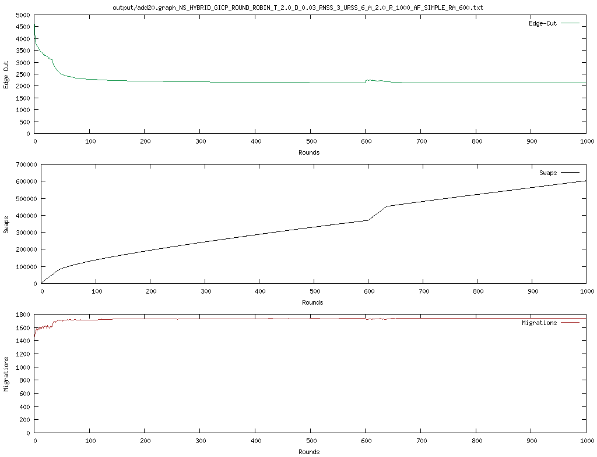

# ID2222 Assignment report 5

Authors:

- Marco Dallagiacoma [<marcoda@kth.se>](mailto:marcoda@kth.se)
- Roberto Bampi [<bampi@kth.se>](mailto:bampi@kth.se)

The purpose of this first assignment is to implement the JaBeJa algorithm for balanced graph partitioning.

The code is implemented using the provided boilerplate.
In particular the code was modified to add a few new command line parameters to accomodate for the requirements of the exercise.
The parameters added are the following:

* `-acceptanceFunction` which controls the acceptance function to use. 
The alternatives are `SIMPLE` which is the linear algorithm provided in the original paper and `EXPONENTIAL` which uses the formula 
$$p = \mathrm{e}^{\frac{old_c - new_c}{T}}$$ to calculate the probability of the swap.

* `-restartAfter` which controls whether or not the simulated annealing process will be restarted. If the parameter is a positive integer, such as 400, the simulated annealing will be restarted when the specified number of iterations is reached. A value of -1, the default, disables this behavior.

# Results
The resulting program was run on the _3elt_, _add20_, _facebook_ and _twitter_ multiple times with different parameters.
Each graph was processed with both the `SIMPLE` and `EXPONENTIAL` acceptance function and both with and without restarts at 600 iterations.
The resulting graphs are attached below.

## 3elt

### exponential

### exponential with restart

### simple

### simple with restart

## add20

### exponential

### exponential with restart

### simple

### simple with restart

## facebook

### exponential

### exponential with restart

### simple

### simple with restart

## twitter

### exponential

### exponential with restart

### simple

### simple with restart

